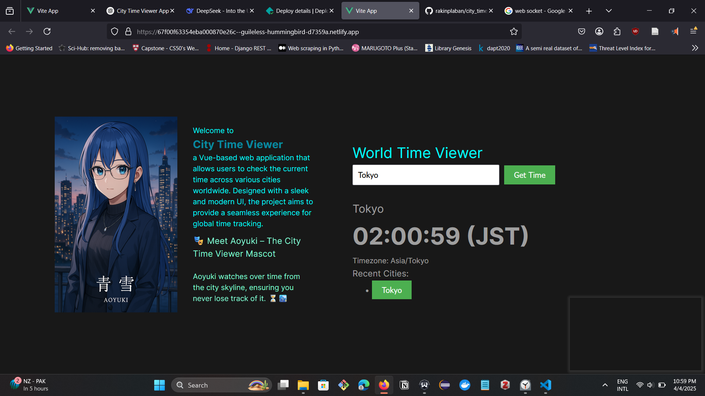

# City Time Viewer Frontend

<!--  -->

Welcome to **City Time Viewer**, a Vue-based web application that allows users to check the current time across various cities worldwide. Designed with a sleek and modern UI, the project aims to provide a seamless experience for global time tracking.

## 🎭 Meet Aoyuki – The City Time Viewer Mascot  
  
Aoyuki watches over time from the city skyline, ensuring you never lose track of it. ⏳🏙️


## ✨ Features
- 🌍 View the current time for any city worldwide
- 🔄 Auto-updating time display
- 🎨 Elegant and responsive UI built with Vue 3
- 📌 Add and remove favorite cities
- 🌗 Dark and Light mode support

## 🚀 Tech Stack
- **Frontend:** Vue 3, Vue Router, Pinia (State Management)
- **Styling:** Tailwind CSS
- **API:** World Time API / Custom Backend (optional)
- **Deployment:** Vercel / Netlify

## 📸 Preview
> 

## 🔧 Installation

```bash
# Clone the repository
git clone https://github.com/your-username/city-time-viewer.git
cd city-time-viewer

# Install dependencies
npm install

# Run the development server
npm run dev
```

## 📜 Usage
1. Search for a city in the search bar.
2. Click on a city to view its current time.
3. Add cities to your favorites for quick access.
4. Toggle between light and dark modes for a customized view.

## 🌟 Contribution
We welcome contributions! Feel free to submit pull requests, report issues, or suggest improvements.

## 📜 License
This project is licensed under the [MIT License](LICENSE).

## 🎭 Special Thanks
Aoyuki, our serene anime-themed mascot, watches over time from the city skyline. 🏙️✨

---

**Star 🌟 This Repo** if you like the project! 🚀


<!-- # .

This template should help get you started developing with Vue 3 in Vite.

## Recommended IDE Setup

[VSCode](https://code.visualstudio.com/) + [Volar](https://marketplace.visualstudio.com/items?itemName=Vue.volar) (and disable Vetur).

## Customize configuration

See [Vite Configuration Reference](https://vite.dev/config/).

## Project Setup

```sh
npm install
```

### Compile and Hot-Reload for Development

```sh
npm run dev
```

### Compile and Minify for Production

```sh
npm run build
``` -->
